# Live2D Cubism Core API Reference

**Version r13**

**Last Update 2025/05/15**

Copyright © 2025 Live2D Inc. all rights reserved.

---

## Changelog

| Update day | Version | Update Type | Content                                                                                                                                                                                                                                                                                                                                                                                                                                                  |
| :--- | :--- | :--- | :--- |
| 2018/06/14 | r2 | translation | translation to English from Japanese                                                                                                                                                                                                                                                                                                                                                                                                                         |
| 2018/07/20 | r3 | Corrected | Corrected errors of snippet<br>Corrected vague expression<br>Corrected omissions of letter in snippet<br>Added more detailed explanation about rendering method of mask and how to access it<br>Corrected mistake that const is included in notation of arguments.                                                                                                                                                                                                   |
| 2019/02/26 | r5 | Added | Added "File version of moc3"<br>Added "Getting the parent parts of the parts"<br>Added the API description of `csmGetLatestMocVersion`<br>Added the API description of `csmGetMocVersion`<br>Added the API description of `csmGetPartParentPartIndices`                                                                                                                                                                                                             |
| 2019/08/01 | r6 | Added | Added a constant stands for moc3 file version<br>Added a snippet since the ConstantFlag element has added<br>Added a description of the Inverted Mask flag<br>Added a description of the Inverted Mask function<br>Added an item stands for the available version of each API                                                                                                                                                                                            |
| | | Fixed | Typo fixes                                                                                                                                                                                                                                                                                                                                                                                                                                                                           |
| 2019/09/04 | r7 | Fixed | Adjusted notation of "Cubism Core" and "Cubism SDK"                                                                                                                                                                                                                                                                                                                                                                                                                    |
| 2021/03/01 | r8 | Fixed | Added an explanation for the existence of Drawables with a count of 0 in `csmGetDrawableIndexCounts`.                                                                                                                                                                                                                                                                                                                                                              |
| | | Fixed | Added explanation of the case where `csmGetDrawableIndices` does not store valid addresses.                                                                                                                                                                                                                                                                                                                                                                                         |
| 2022/05/19 | r9 | Added | Added explanations of the function to obtain parameter keys.                                                                                                                                                                                                                                                                                                                                                                                                           |
| | | Added | Added explanations of the multiply color and the screen colors.                                                                                                                                                                                                                                                                                                                                                                                                                   |
| 2022/07/07 | r10 | Added | Added description of the function to get parameter types.                                                                                                                                                                                                                                                                                                                                                                                                             |
| | | Added | Added description of the function to get parent parts of ArtMeshes.                                                                                                                                                                                                                                                                                                                                                                                                                |
| | | Added | Updated obtained versions in "File version of moc3" and "`csmGetMocVersion`".                                                                                                                                                                                                                                                                                                                                                                                                         |
| 2022/03/10 | r11 | Added | Added description of the function to validate MOC3.                                                                                                                                                                                                                                                                                                                                                                                                                   |
| 2023/08/17 | r12 | Added | Added information on Cubism 5.                                                                                                                                                                                                                                                                                                                                                                                                                                           |
| **2025/05/15** | **r13** | **Added** | **Added description of the function to get and set the repeat value set for the parameters.**                                                                                                                                                                                                                                                                                                                                                             |

> ※ Highlighted sentences mean the latest modification and addition.

---

## Contents

*   [Overall](#overall)
    *   [Regarding this document](#regarding-this-document)
    *   [Functional classification of Core and Framework](#functional-classification-of-core-and-framework)
        *   [What is Core?](#what-is-core)
    *   [How to render a model.](#how-to-render-a-model)
        *   [Data for rendering provided by Core](#data-for-rendering-provided-by-core)
        *   [Cycles of Rendering and behavior of the Core](#cycles-of-rendering-and-behavior-of-the-core)
*   [How to use the API for each scene](#how-to-use-the-api-for-each-scene)
    *   [How to obtain the information related to the Core.](#how-to-obtain-the-information-related-to-the-core)
        *   [How to obtain the version information of the Core.](#how-to-obtain-the-version-information-of-the-core)
        *   [Output log of the Core.](#output-log-of-the-core)
    *   [Loading files](#loading-files)
        *   [How to load a Moc3 file and to expand up to the csmModel object](#how-to-load-a-moc3-file-and-to-expand-up-to-the-csmmodel-object)
        *   [Check moc3 consistency](#check-moc3-consistency)
        *   [File version of moc3](#file-version-of-moc3)
        *   [Release csmMoc or csmModel](#release-csmmoc-or-csmmodel)
        *   [Get rendering size of model](#get-rendering-size-of-model)
        *   [Loading and placement Drawable](#loading-and-placement-drawable)
        *   [Gets the parent parts of Drawable](#gets-the-parent-parts-of-drawable)
    *   [Manipulate the model](#manipulate-the-model)
        *   [Acquiring each element of the parameter](#acquiring-each-element-of-the-parameter)
        *   [Gets the parent parts of parts](#gets-the-parent-parts-of-parts)
        *   [Operating parameters](#operating-parameters)
        *   [Operating parts opacity.](#operating-parts-opacity)
        *   [Applying the operation to the model.](#applying-the-operation-to-the-model)
        *   [Reset of DynamicFlag](#reset-of-dynamicflag)
    *   [Rendering](#rendering)
        *   [Necessary processes for rendering](#necessary-processes-for-rendering)
        *   [Specification of rendering](#specification-of-rendering)
        *   [Confirmation of updated information](#confirmation-of-updated-information)
        *   [Obtaining the updated vertex information](#obtaining-the-updated-vertex-information)
        *   [Sorting drawing order of Drawable](#sorting-drawing-order-of-drawable)
        *   [DrawOrder and RenderOrder](#draworder-and-renderorder)
        *   [Apply mask on rendering.](#apply-mask-on-rendering)
        *   [Apply the multiply color and screen color to the shader](#apply-the-multiply-color-and-screen-color-to-the-shader)
        *   [Getting the parameter keys](#getting-the-parameter-keys)
        *   [Determine whether repeat is set for a parameter](#determine-whether-repeat-is-set-for-a-parameter)
*   [Individual APIs](#individual-apis)
    *   [Naming rule for the APIs.](#naming-rule-for-the-apis)
        *   [SOA structure](#soa-structure)
        *   [InPlace](#inplace)
    *   [`csmGetVersion`](#csmgetversion)
    *   [`csmGetLatestMocVersion`](#csmgetlatestmocversion)
    *   [`csmGetMocVersion`](#csmgetmocversion)
    *   [`csmGetLogFunction`](#csmgetlogfunction)
    *   [`csmSetLogFunction`](#csmsetlogfunction)
    *   [`csmReviveMocInPlace`](#csmrevivemocinplace)
    *   [`csmGetSizeofModel`](#csmgetsizeofmodel)
    *   [`csmInitializeModelInPlace`](#csminitializemodelinplace)
    *   [`csmUpdateModel`](#csmupdatemodel)
    *   [`csmReadCanvasInfo`](#csmreadcanvasinfo)
    *   [`csmGetParameterCount`](#csmgetparametercount)
    *   [`csmGetParameterIds`](#csmgetparameterids)
    *   [`csmGetParameterTypes`](#csmgetparametertypes)
    *   [`csmGetParameterMinimumValues`](#csmgetparameterminimumnvalues)
    *   [`csmGetParameterMaximumValues`](#csmgetparametermaximumnvalues)
    *   [`csmGetParameterDefaultValues`](#csmgetparameterdefaultvalues)
    *   [`csmGetParameterValues`](#csmgetparametervalues)
    *   [`csmGetParameterRepeats`](#csmgetparameterrepeats)
    *   [`csmGetParameterKeyCounts`](#csmgetparameterkeycounts)
    *   [`csmGetParameterKeyValues`](#csmgetparameterkeyvalues)
    *   [`csmGetPartCount`](#csmgetpartcount)
    *   [`csmGetPartIds`](#csmgetpartids)
    *   [`csmGetPartOpacities`](#csmgetpartopacities)
    *   [`csmGetPartParentPartIndices`](#csmgetpartparentpartindices)
    *   [`csmGetDrawableCount`](#csmgetdrawablecount)
    *   [`csmGetDrawableIds`](#csmgetdrawableids)
    *   [`csmGetDrawableConstantFlags`](#csmgetdrawableconstantflags)
    *   [`csmGetDrawableDynamicFlags`](#csmgetdrawabledynamicflags)
    *   [`csmGetDrawableTextureIndices`](#csmgetdrawabletextureindices)
    *   [`csmGetDrawableDrawOrders`](#csmgetdrawabledraworders)
    *   [`csmGetDrawableRenderOrders`](#csmgetdrawablerenderorders)
    *   [`csmGetDrawableOpacities`](#csmgetdrawableopacities)
    *   [`csmGetDrawableMaskCounts`](#csmgetdrawablemaskcounts)
    *   [`csmGetDrawableMasks`](#csmgetdrawablemasks)
    *   [`csmGetDrawableVertexCounts`](#csmgetdrawablevertexcounts)
    *   [`csmGetDrawableVertexPositions`](#csmgetdrawablevertexpositions)
    *   [`csmGetDrawableVertexUvs`](#csmgetdrawablevertexuvs)
    *   [`csmGetDrawableIndexCounts`](#csmgetdrawableindexcounts)
    *   [`csmGetDrawableIndices`](#csmgetdrawableindices)
    *   [`csmResetDrawableDynamicFlags`](#csmresetdrawabledynamicflags)
    *   [`csmGetDrawableMultipleColors`](#csmgetdrawablemultiplecolors)
    *   [`csmGetDrawableScreenColors`](#csmgetdrawablescreencolors)
    *   [`csmGetDrawableParentPartIndices`](#csmgetdrawableparentpartindices)
    *   [`csmHasMocConsistency`](#csmhasmocconsistency)

---

## Overall

### Regarding this document

In this document, you can learn functions of Live2D Cubism Core (Core) in Live2D Cubism SDK, how to use it and specification of its API

**Target**
- Users of Live2D Cubism SDK
- Those who are considering embedding wrapper to call Core from other languages such as Java and Python
- Those who are considering embedding into other programs or platform such as game engines.

### Functional classification of Core and Framework

The following chart shows the relationship between the Application and Core and Framework, and their roles.
Core is called from both Application and Framework.

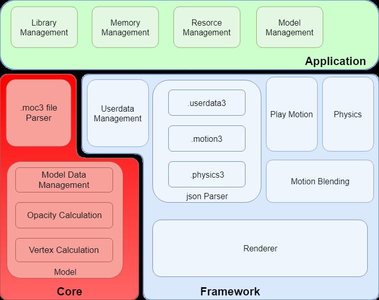

### What is Core?

Core is a library including API necessary for handling models (.moc3 file) created with Live2D Cubism Editor. Its features are explained in the following.

- The API is coded by C language.
- The Core doesn't keep and discard Memory. It is necessary to keep the specified amount of Memory on users' side and provide it to the Core for its request.
- The core doesn't equip rendering function. The role of the Core is to calculate vertex information according to the parameters of a model. Applications or programs obtain calculated vertex information and information necessary for rendering (UV, opacity etc) from Core. Also, it doesn't needed to implement the rendering function for the Core since Framework provides reference implementation.

Due to the features written above, the core has high portability. Also it is not dependent on platforms.

### How to render a model.

Different from Live2D Cubism 2 SDK, rendering function was separated from the Core after Live2D Cubism 3 SDK.
The advantage of this change is that it is possible for developers to embed Cubism into various environments.
The rendering function is provided in Framework as a reference implementation for popular use cases. Even in an environment that the function has not been provided, it is possible to have the function by obtaining 3D primitives information such as vertex information with the API of the Core and the rendering APIs specified for environment.

#### Data for rendering provided by Core

The data that Core provides about models is classified into three major categories: Parameter, Part, and Drawable.

Among them, Drawable is a collection of data necessary for rendering.
Vertex information provided by Drawable is two-dimensional data which consists of X and Y.
The starting point of coordinates for each element is bottom left. Also, the surface of the polygon is counter-clockwise.
The data is in accordance with the coordinate system of OpenGL.

### Cycles of Rendering and behavior of the Core

The following chart shows the flow of processing for loading a model file (.moc3).

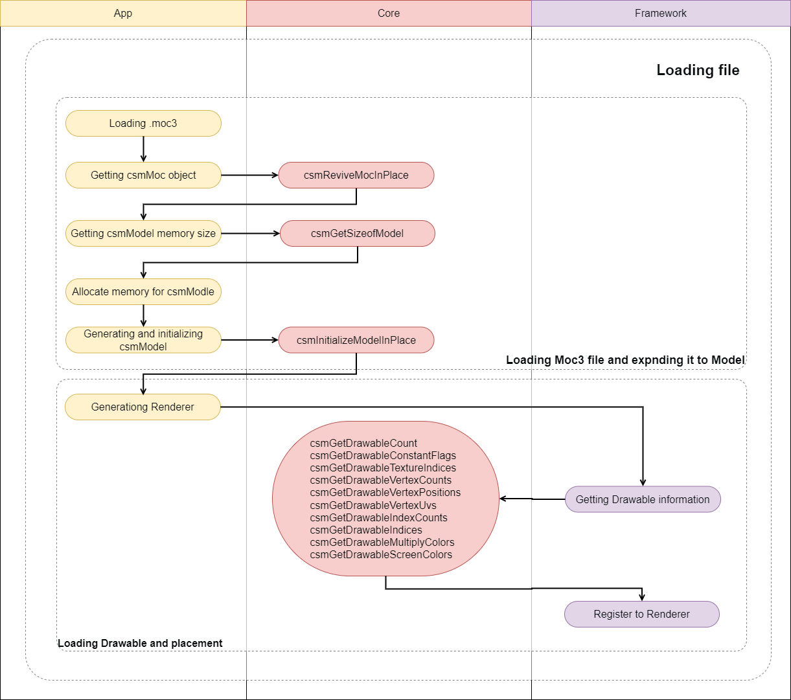

> Yellow node shows Application, purple node means a segment Framework should process. Nodes with arrow to the Core indicate calls to API of the Core.

The following chart shows the refresh cycle of rendering.

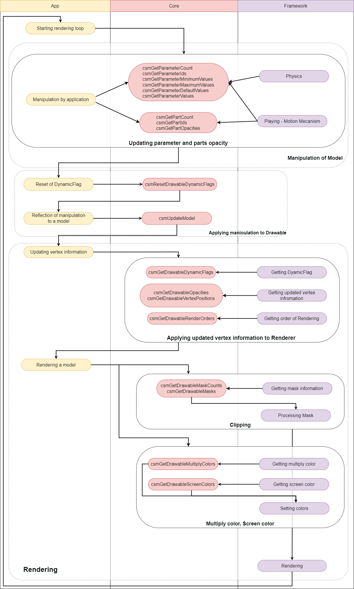

> Same as the first chart, yellow node shows Application, purple node means a segment Framework should process. Nodes with arrow to the Core indicate calls to API of the Core. The sections surrounded by solid lines are simplified explanation.

---

## How to use the API for each scene

### How to obtain the information related to the Core.

#### How to obtain the version information of the Core.

Version information of the Core currently used can be obtained

**snippet:**
```c
csmVersion version = csmGetVersion();
```

Version notation consists of three parts: MAJOR, MINOR, and PATCH. Operation rule for each part is shown below.

**Major version (1 byte)**
It is incremented when backward compatibility is lost with model data due to some reason such as major version up of Cubism Editor.

**Minor version (1 byte)**
It is incremented when function was added with backward compatibility kept.

**Patch number (2 byte)**
It is incremented when the defect is fixed. If the major version or minor version is changed, the patch number is reset to 0.

```
0x 00   00   0000
   Major Minor Patch
```

The version consists of 4 bytes. By treating it as an unsigned integer, the new Core version always means a larger number.

**Link to the used API**
[`csmGetVersion`](#csmgetversion)

#### Output log of the Core.

In order to output the log of the Core, the function to output log can be preset. For example, if an error occurs when using the Core API, a log gets output through the preset function.

The function to output log that can be preset is the following.

**snippet:**
```c
/** Log handler.
 *
 * @param message Null-terminated string message to log.
 */
typedef void (*csmLogFunction)(const char* message);
```

**Example:**
```c
void logPrint(const char* message)
{
    printf("[LOG] %s", message);
}

// Set Cubism log handler.
csmSetLogFunction(logPrint);
```

**Link to the used API**
- [`csmSetLogFunction`](#csmsetlogfunction)
- [`csmGetLogFunction`](#csmgetlogfunction)

### Loading files

#### How to load a Moc3 file and to expand up to the csmModel object

Model information is stored in moc3. It needs to be expanded up to csmModel object to be handled in Core.
After expanding it to csmModel, API needs to be operated with csmModel as the key.
**Memory area to generate object of csmMoc and csmModel needs to have address aligned by specified size.**
Alignment size is written in the include.

**Loading moc3**
```c
/** Alignment size definition */
enum
{
    /** Necessary alignment for mocs (in bytes). */
    csmAlignofMoc = 64,

    /** Necessary alignment for models (in bytes). */
    csmAlignofModel = 16
};


void* mocMemory;
unsigned int mocSize;

// Load file to memory address aligned as 64byte.
// The file size of .moc3 is stored in mocSize.
mocMemory = ReadBlobAligned("Koharu/Koharu.moc3", csmAlignofMoc, &mocSize);

csmMoc* moc = csmReviveMocInPlace(mocMemory, mocSize);
```

**Create a model from moc 3:**
```c
unsigned int modelSize = csmGetSizeofModel(moc);

// The model needs to be aligned as 16 bytes
void** modelMemory = AllocateAligned(modelSize, csmAlignofModel);

// Create an instance of the model
csmModel* model = csmInitializeModelInPlace(moc, modelMemory, modelSize);
```

#### Check moc3 consistency

Using `csmHasMocConsistency`, you can check the consistency of the .moc3 file to be loaded to ensure that it is not malformed.
If the consistency of the .moc3 file cannot be verified, return 0.

If an unspecified .moc3 file is expected to be loaded, it is recommended to check its consistency before creating the csmMoc object with `csmInitializeModelInPlace`.
However, please note that checking consistency may affect performance.

**snippet:**
```c
void* mocMemory;
unsigned int mocSize;

// Load file to memory address aligned as 64byte.
// The file size of .moc3 is stored in mocSize.
mocMemory = ReadBlobAligned("Koharu/Koharu.moc3", csmAlignofMoc, &mocSize);

// Check moc3 consistency.
int consistency = csmHasMocConsistency(mocMemory, mocSize);

if(!consistency)
{
    // Do not process if consistency cannot be verified.
    return;
}

// Create an instance of the model
csmModel* model = csmInitializeModelInPlace(moc, modelMemory, modelSize);
```

**Link to the used API**
[`csmHasMocConsistency`](#csmhasmocconsistency)

#### File version of moc3

moc3 file format had a version up. New moc3 file may not be read in the old Core. Core has the compatibility to the moc3 file of the following corresponding version. `csmGetLatestMocVersion` shows the latest file version that Core can process.

```c
/** moc3 file format version. */
enum
{
    /** unknown */
    csmMocVersion_Unknown = 0,
    /** moc3 file version 3.0.00 - 3.2.07 */
    csmMocVersion_30 = 1,
    /** moc3 file version 3.3.00 - 3.3.03 */
    csmMocVersion_33 = 2,
    /** moc3 file version 4.0.00 - 4.1.05 */
    csmMocVersion_40 = 3,
    /** moc3 file version 4.2.00 - 4.2.02 */
    csmMocVersion_42 = 4,
    /** moc3 file version 5.0.00 - */
    csmMocVersion_50 = 5
};

/** moc3 version identifier. */
typedef unsigned int csmMocVersion;

/**
 * Gets Moc file supported latest version.
 *
 * @return csmMocVersion (Moc file latest format version).
 */
csmApi csmMocVersion csmGetLatestMocVersion();

/**
 * Gets Moc file format version.
 *
 * @param address Address of moc.
 * @param size    Size of moc (in bytes).
 *
 * @return csmMocVersion
 */
csmApi csmMocVersion csmGetMocVersion(const void* address, const unsigned int size);
```

`csmGetMocVersion` shows the file version of moc3. If it is not moc3 file, it returns `csmMocVersion_Unknown` = 0. The execution order of `csmGetMocVersion` is not tied to the timing of the `csmReviveMocInPlace`. To check whether the file can be loaded by comparing the got file version and Core version.

**To expand to the model while examining the file version of moc3.**
```c
void* mocMemory;
unsigned int mocSize;

// Load file to memory address aligned as 64byte.
// The file size of .moc3 is stored in mocSize.
mocMemory = ReadBlobAligned("Koharu/Koharu.moc3", csmAlignofMoc, &mocSize);

const csmMocVersion fileVersion = csmGetMocVersion(mocMemory, mocSize);

if((csmGetLatestMocVersion() < fileVersion) || (fileVersion == 0))
{
    Log("can't load moc3 file");
    return;
}

csmMoc* moc = csmReviveMocInPlace(mocMemory, mocSize);

unsigned int modelSize = csmGetSizeofModel(moc);

// The model needs to be aligned as 16 bytes
void** modelMemory = AllocateAligned(modelSize, csmAlignofModel);

// Create an instance of the model
csmModel* model = csmInitializeModelInPlace(moc, modelMemory, modelSize);
```

If you attempt to load the new files with older versions of the Core, the return value of `csmReviveMocInPlace` will be NULL.
If the Core version from `csmGetVersion()` is 03.03.0000(50528256) or later, the message below will be output to the Core logs.

> `csmReviveMocInPlace` is failed. The Core unsupport later than moc3 ver:2. This moc3 ver is 3.

Please do use the latest Core.

#### Release csmMoc or csmModel

`csmReviveMocInPlace`, `csmInitializeModelInPlace` needs to be operated only within the input memory space. The returned address is always the one in the prepared memory area. `csmMoc` and `csmModel` exist in the memory area used for input in `csmReviveMocInPlace`, `csmInitializeModelInPlace`. Accordingly the input memory area needs to be kept.
Also, `csmMoc` needs to be kept until all corresponding `csmModels` gets discarded. This is because `csmModel` refers to `csmMoc`.

Release memory targeting not addresses of `csmMoc` or `csmModel` but its of `mocMemory` or `modelMemory` when `csmMoc` and `csmModel` needs to be discarded.

The following chart shows the flow about securing and releasing memory.

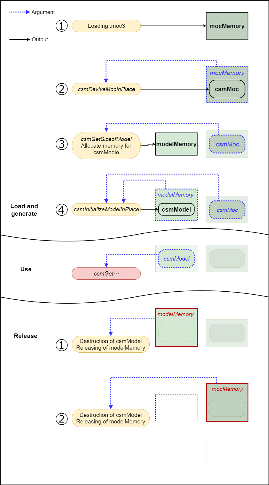

**Link to the used API**
- [`csmReviveMocInPlace`](#csmrevivemocinplace)
- [`csmGetSizeofModel`](#csmgetsizeofmodel)
- [`csmInitializeModelInPlace`](#csminitializemodelinplace)

#### Get rendering size of model

canvas size displayed as work area in Editor, center position and unit position that can be specified when model file is exported can be obtained.

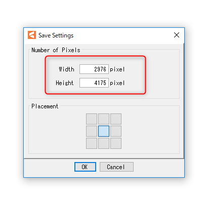


*(Description of Editor UI for Export Settings)*
The export settings dialog allows specifying canvas properties:
1.  **Center of model X**: The horizontal center point of the model on the canvas (e.g., 0.50).
2.  **Center of model Y**: The vertical center point of the model on the canvas (e.g., 0.50).
3.  **Canvas scale (Unit)**: The width of the canvas in Cubism units (e.g., 1.00).
4.  **Canvas height (Unit)**: The height of the canvas in Cubism units (e.g., 1.40).
5.  **pixelsPerUnit**: The number of pixels that correspond to one Cubism unit (e.g., 2976.00).

**Access to canvas information of model.**
```c
csmVector2 size;
csmVector2 origin;
float pixelsPerUnit;

csmReadCanvasInfo(Sample.Model, &size, &origin, &pixelsPerUnit);

printf("size.X=%5.1f",size.X);       // size.X = 2400.0 = (3) * (5)
printf("size.Y=%5.1f",size.Y);       // size.Y = 3000.0 = (4) * (5)
printf("origin.X=%5.1f",origin.X);   // origin.X = 1200.0 = (1) * (5)
printf("origin.Y=%5.1f",origin.Y);   // origin.Y = 1500.0 = (2) * (5)
printf("pixelsPerUnit=%5.1f",pixelsPerUnit); // pixelsPerUnit = 2400.0 = (5)
```

**Link to the used API**
[`csmReadCanvasInfo`](#csmreadcanvasinfo)

#### Loading and placement Drawable

Drawable means a unit of drawing in the Core. Drawable corresponds to an art mesh on the Editor. Drawable has the necessary information to draw.
There are static information that does not change and dynamic information that changes by changing the value of the parameter in a data loaded from moc3. Static information can be cached in the application side.

The group having `csmGet[XXXX]Count` is structure of array (SOA). The number of arrays can be obtained by Count.
An array obtained with an API such as `csmGetDrawableTextureIndices` is the starting address of the array.
Arrays in each API have the same sequences. When it is necessary to look for a particular parameter, the parameter needs to be searched in the array obtained by `csmGetDrawableIds`.
Parameters, parts, etc are described the same manner.

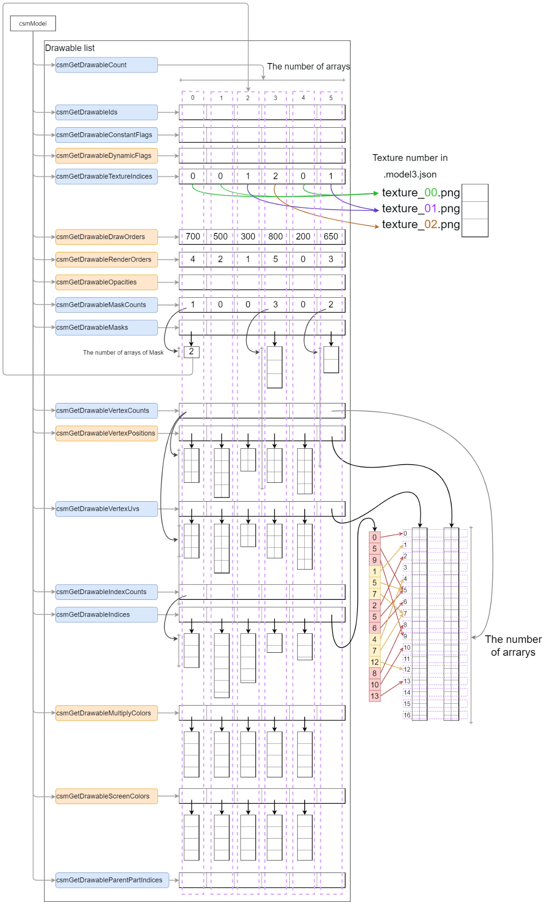

>*(A detailed diagram on page 21 shows the Structure Of Array (SOA) layout for Drawables, where functions like `csmGetDrawableIds`, `csmGetDrawableConstantFlags`, `csmGetDrawableVertexCounts`, etc., return pointers to parallel arrays. Blue APIs are static, Orange APIs are dynamic.)*

In loading Drawable, preparation for attribute of the render such as registration to the graphics API or generation structure for drawing order sorting will be getting done.

**Conversion from Drawable SOA to AOS structure**
```c
// Initialization
drawableCount = csmGetDrawableCount(model);
drawables = Allocate(sizeof(Drawable) * drawableCount);

textureIndices = csmGetDrawableTextureIndices(model);
constantFlags = csmGetDrawableConstantFlags(model);

vertexCounts = csmGetDrawableVertexCounts(model);
vertexPositions = csmGetDrawableVertexPositions(model);
vertexUvs = csmGetDrawableVertexUvs(model);

indexCounts = csmGetDrawableIndexCounts(model);
vertexIndices = csmGetDrawableIndices(model);

ids = csmGetDrawableIds(model);
opacities = csmGetDrawableOpacities(model);
drawOrders = csmGetDrawableDrawOrders(model);
renderOrders = csmGetDrawableRenderOrders(model);
dynamicFlags = csmGetDrawableDynamicFlags(model);

maskCounts = csmGetDrawableMaskCounts(model);
masks = csmGetDrawableMasks(model);

// Initialize static drawable fields.
for (d = 0; d < drawableCount; ++d)
{
    drawables[d].TextureIndex = textureIndices[d];

    if ((constantFlags[d] & csmBlendAdditive) == csmBlendAdditive)
    {
        drawables[d].BlendMode = csmAdditiveBlending;
    }
    else if ((constantFlags[d] & csmBlendMultiplicative) == csmBlendMultiplicative)
    {
        drawables[d].BlendMode = csmMultiplicativeBlending;
    }
    else
    {
        drawables[d].BlendMode = csmNormalBlending;
    }

    drawables[d].IsDoubleSided = (constantFlags[d] & csmIsDoubleSided) == csmIsDoubleSided;
    drawables[d].IsInvertedMask = (constantFlags[d] & csmIsInvertedMask) == csmIsInvertedMask;
    drawables[d].VertexCount = vertexCounts[d];
    drawables[d].VertexPositions = Allocate(sizeof(Vector3) * vertexCounts[d]);
    drawables[d].VertexUvs = Allocate(sizeof(Vector2) * vertexCounts[d]);

    // Both VertexPositions and VertexUvs show information two-dimension.
    // vertexCounts shows the number of vertices, different from indices.
    for (i = 0; i < vertexCounts[d]; ++i)
    {
        drawables[d].VertexPositions[i].x = vertexPositions[d][i].X;
        drawables[d].VertexPositions[i].y = vertexPositions[d][i].Y;
        // Note that there is no Vertex Position but x and y
        drawables[d].VertexPositions[i].z = 0;

        drawables[d].VertexUvs[i].x = vertexUvs[d][i].X;
        drawables[d].VertexUvs[i].y = vertexUvs[d][i].Y;
    }

    // vertexIndices[d] are all triangular notation indexCounts[d] always gets a multiple number of 3.
    drawables[d].IndexCount = indexCounts[d];
    drawables[d].Indices = vertexIndices[d]; // Got as a single array

    // Register values such as VertexPositions, VertexUvs, vertexIndices, etc. in the graphics API
    drawables[d].Mesh = MakeMesh(drawables[d].VertexCount,
                                 drawables[d].VertexPositions,
                                 drawables[d].VertexUvs,
                                 drawables[d].IndexCount,
                                 drawables[d].Indices);

    // Access to other Drawable elements
    drawables[d].ID = ids[d];
    drawables[d].DrawOrder = drawOrders[d];

    // The following three items are important on rendering.
    drawables[d].Opacity = opacities[d];
    drawables[d].RenderOrder = renderOrders[d];
    drawables[d].DynamicFlag = dynamicFlags[d];

    drawables[d].MaskCount = maskCounts[d];
    drawables[d].Masks = Allocate(sizeof(int) * maskCounts[d]);
    for (m = 0; m < maskCounts[d]; ++m)
    {
        drawables[d].Masks[m] = masks[d][m];
        // Numbers in masks are index of Drawable
        drawables[d].MaskLinks = &drawables[(masks[d][m])];
    }
}
```

Vertex X,Y obtained by `csmGetDrawableVertexPositions` are influenced by `PixelsPerUnit` of canvas setting on export from Cubism Editor for embedding.

The value of X and Y are shown as a unit. The value can be calculated by the following formula.

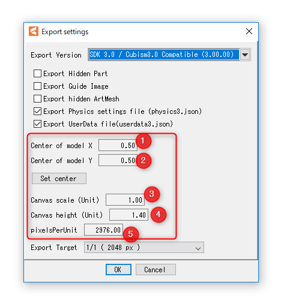

Using the numbered items from the [Export Settings description](#get-rendering-size-of-model):
>`X = (localX / [5]) - ([1] * [3])`

>`Y = ([2] * [4]) - (localY / [5])`

Vertex information whose aspect ratio has been kept is saved. Even if the vertex is beyond the boundary it'll be saved as it is. For more details, please refer to "Area of DrawableVertexPotions" (BROKEN PDF HYPERLINK TODO).

**Link to the used API**
- [`csmGetDrawableCount`](#csmgetdrawablecount)
- [`csmGetDrawableIds`](#csmgetdrawableids)
- [`csmGetDrawableConstantFlags`](#csmgetdrawableconstantflags)
- [`csmGetDrawableDynamicFlags`](#csmgetdrawabledynamicflags)
- [`csmGetDrawableTextureIndices`](#csmgetdrawabletextureindices)
- [`csmGetDrawableDrawOrders`](#csmgetdrawabledraworders)
- [`csmGetDrawableRenderOrders`](#csmgetdrawablerenderorders)
- [`csmGetDrawableOpacities`](#csmgetdrawableopacities)
- [`csmGetDrawableMaskCounts`](#csmgetdrawablemaskcounts)
- [`csmGetDrawableMasks`](#csmgetdrawablemasks)
- [`csmGetDrawableVertexCounts`](#csmgetdrawablevertexcounts)
- [`csmGetDrawableVertexPositions`](#csmgetdrawablevertexpositions)
- [`csmGetDrawableVertexUvs`](#csmgetdrawablevertexuvs)
- [`csmGetDrawableIndexCounts`](#csmgetdrawableindexcounts)
- [`csmGetDrawableIndices`](#csmgetdrawableindices)

#### Gets the parent parts of Drawable

Parts are made of tree structure. This tree structure is created by the operation of the editor. `csmModel` even holds the information of the structure that is generated from moc3.
The results of `csmGetDrawableParentPartIndices` shows the parent of Drawables by index in array.
When the parent number indicates the -1, it indicates that the parent is the Root.

```c
// init
partIds = csmGetPartIds(model);
drawableCount = csmGetDrawableCount(model);
drawableParentPartIndices = csmGetDrawableParentPartIndices(model);
drawableIds = csmGetDrawableIds(model);

// If drawableParentIndex = -1, parent is empty.
// If drawableParentIndex >= 0, the value of parentPartIndices is the Index of the parent.
for (int i = 0; i < drawableCount; ++i)
{
    if(drawableParentPartIndices[i] == -1)
    {
        printf("drawableParentPartIndices[%d]:%s does not have a parent part.", i, drawableIds[i]);
    }
    else
    {
        printf("drawableParentPartIndices[%d]:Parent part of %s is %s.", i, drawableIds[i],
            partIds[drawableParentPartIndices[i]]);
    }
}
```

**Link to the used API**
[`csmGetDrawableParentPartIndices`](#csmgetdrawableparentpartindices)

### Manipulate the model

#### Acquiring each element of the parameter

It is necessary to understand each element of the parameter to manipulate the model. The following 5 things are the elements.
- ID
- Present value
- Maximum value
- Minimum value
- Initial value

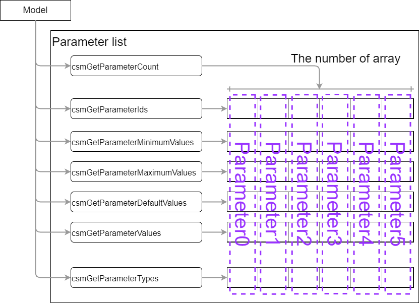

**Access to the elements of each parameter**
```c
parameterCount = csmGetParameterCount(model);
parameterIds = csmGetParameterIds(model);
parameterValues = csmGetParameterValues(model);
parameterMaximumValues = csmGetParameterMaximumValues(model);
parameterMinimumValues = csmGetParameterMinimumValues(model);
parameterDefaultValues = csmGetParameterDefaultValues(model);
targetnum = -1;

for( i = 0; i < parameterCount ;++i)
{
    if(strcmp("ParamMouthOpenY",parameterIds[i]) == 0 )
    {
        targetnum = i;
        break;
    }
}

// In case that the desired ID couldn't be found
if(targetnum == -1 )
{
    return;
}

// The minimum value, maximum value, initial value of "ParamMouthOpenY" parameter of the model is exported.
// min:0.0 max:1.0 default:0.0
printf("min:%3.1f max:%3.1f default:%3.1f", 
    parameterMinimumValues[targetnum],
    parameterMaximumValues[targetnum],
    parameterDefaultValues[targetnum] );
```

Although movement manipulation is not directly involved, it is also possible to get the types set for the parameters of Blend Shapes etc.

**Getting types set for each parameter**
```c
/** Parameter types. */
enum
{
    /** Normal Parameter. */
    csmParameterType_Normal = 0,

    /** Parameter for blend shape. */
    csmParameterType_BlendShape = 1
};

/** Parameter type. */
typedef int csmParameterType;

//...

parameterCount = csmGetParameterCount(model);
parameterIds = csmGetParameterIds(model);
parameterTypes = csmGetParameterTypes(model);

for( i = 0; i < parameterCount ;++i)
{
    switch(parameterTypes[i])
    {
        case csmParameterType_Normal :
            printf("%s: Normal\n", parameterIds[i]);
            break;

        case csmParameterType_BlendShape :
            printf("%s: BlendShape\n", parameterIds[i]);
            break;
    }
}
```

**Link to the used API**
- [`csmGetParameterCount`](#csmgetparametercount)
- [`csmGetParameterIds`](#csmgetparameterids)
- [`csmGetParameterValues`](#csmgetparametervalues)
- [`csmGetParameterMaximumValues`](#csmgetparametermaximumnvalues)
- [`csmGetParameterMinimumValues`](#csmgetparameterminimumnvalues)
- [`csmGetParameterDefaultValues`](#csmgetparameterdefaultvalues)
- [`csmGetParameterTypes`](#csmgetparametertypes)

#### Gets the parent parts of parts

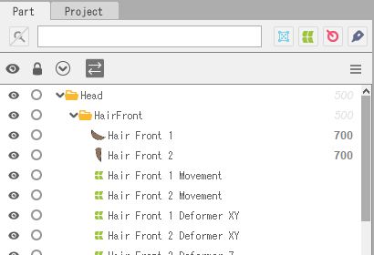

Parts are made of tree structure. 

This tree structure is created by the operation of the editor.

`csmModel` even holds the information of the structure that is generated from moc3.

The results of `csmGetPartParentPartIndices` shows the parent of parts by index in array.

When the parent number indicates the -1, it indicates that the parent is the Root.

```c
// Getting the ID list of parts.
const char** partIds = csmGetPartIds(model);

// Getting the parent of the index list of parts.
const int* parentPartIndices = csmGetPartParentPartIndices(model);

// If partParentIndex = -1, parent is empty.
// If partParentIndex >= 0, the value of parentPartIndices is the Index of the parent.
for (int i = 0; i < partCount; ++i)
{
    if(partParentIndex[i] == -1)
    {
        printf("partParentIndex[%d]:%s does not have a parent part.", i, partIds[i]);
    }
    else
    {
        printf("partParentIndex[%d]:Parent part of %s is %s.", i, partIds[i], partIds[parentPartIndices[i]]);
    }
}
```
Opacity operations to the parent part also applies to the opacity of the child.

**Link to the used API**
[`csmGetPartParentPartIndices`](#csmgetpartparentpartindices)

#### Operating parameters

> **In the operation to the Cubism model, operation of the parameter is reflected by acquiring the address of the array of parameters and writing the value.**

It is clamped from the minimum value to the maximum value of the parameter when `csmUpdateModel()` is called.

If the repeat setting is made for the parameter, it will not be clamped.

```c
//
parameterIds = csmGetParameterIds(model);
parameterValues = csmGetParameterValues(model);
parameterDefaultValues = csmGetParameterDefaultValues(model);

// Scan array position corresponding to target ID
targetIndex = -1;
for(i = 0; i < parameterCount ;++i)
{
    if(strcmp("ParamMouthOpenY",parameterIds[i]) == 0 )
    {
        targetIndex = i;
        break;
    }
}
//In case that the desired ID couldn't be found ID
if(targetIndex == -1 )
{
    return;
}

//Multiply the difference from reference value by the specified magnification ratio from the parameter.
parameterValues[targetIndex] =
    (value - parameterDefaultValues[targetIndex]) * multipleValues[targetIndex] +
    parameterDefaultValues[targetIndex];
```

**Link to the used API**
- [`csmGetParameterValues`](#csmgetparametervalues)
- [`csmGetParameterDefaultValues`](#csmgetparameterdefaultvalues)

#### Operating parts opacity.

Operation of parts opacity can be done by the same way as operation of a parameter.

> **It is reflected by acquiring the address of the array and writing the value to that memory.**

It is clamped in the range of 0.0 to 1.0 by the processing of `csmUpdateModel`.

```c
// Manipulate opacity
partOpacities = csmGetPartOpacities(model);

// Find parameter index.
targetIndex = -1;

for(i = 0; i < parameterCount ;++i)
{
    if(strcmp("ParamMouthOpenY",parameterIds[i]) == 0 )
    {
        targetIndex = i;
        break;
    }
}
//In case that the desired ID couldn't be found ID
if(targetIndex == -1)
{
    return;
}

partOpacities[targetIndex] = value;
```

**Link to the used API**
[`csmGetPartOpacities`](#csmgetpartopacities)

#### Applying the operation to the model.

After changing the opacity of a parameter or part, the operation must be reflected in the vertex and opacity of the actual Drawable. This operation is done by `csmUpdateModel`.
`csmResetDrawableDynamicFlags()` is needed to be called before `csmUpdateModel()` in order to see which information necessary for drawing has been changed. For more details, refer to "[Resetting DynamicFlag](#reset-of-dynamicflag)"

```c
// Update model.
csmUpdateModel(Model);
```

The affected parts here are...
- `csmGetDrawableDynamicFlags`
- `csmGetDrawableVertexPositions`
- `csmGetDrawableDrawOrders`
- `csmGetDrawableRenderOrders`
- `csmGetDrawableOpacities`

**Link to the used API**
- [`csmUpdateModel`](#csmupdatemodel)
- [`csmGetDrawableDynamicFlags`](#csmgetdrawabledynamicflags)
- [`csmGetDrawableVertexPositions`](#csmgetdrawablevertexpositions)
- [`csmGetDrawableDrawOrders`](#csmgetdrawabledraworders)
- [`csmGetDrawableRenderOrders`](#csmgetdrawablerenderorders)
- [`csmGetDrawableOpacities`](#csmgetdrawableopacities)

#### Reset of DynamicFlag

`csmResetDrawableDynamicFlags` executes writing the difference of the value between former one and current one to `csmGetDrawableDynamicFlags`.
If this operation is skipped, only items of `csmIsVisible` will be updated by `csmGetDrawableDynamicFlags`.
`csmResetDrawableDynamicFlags` needs to be called right before `csmUpdateModel` which will be executed to rendering.

```c
// Reset dynamic drawable flags.
csmResetDrawableDynamicFlags(Sample.Model);
```

**Link to the used API**
[`csmResetDrawableDynamicFlags`](#csmresetdrawabledynamicflags)

### Rendering

#### Necessary processes for rendering

For rendering, the following steps are necessary after the process for model.
- Updating Drawable vertices
- Updating opacity of Drawable
- Sorting drawing order
- Checking validity of Drawable if it is not valid rendering needs to be stopped.
- Mask processing
- Multiply color
- Screen color

Also, rendering in Cubism has elements such as composition of opacity of textures, additive synthesis, multiplicative synthesis, culling, and invert the clipping mask or not.
When implementing rendering of the Cubism model, it is necessary to reproduce them in the same way as Editor does.

#### Specification of rendering

**Confirmation of Element with ConstantFlags**

The synthesis method for each Drawable, on/off of culling, invert the clipping mask or not can be obtained with `csmGetDrawableConstantFlags`.

For the meaning of the obtained Flag, please refer to the constants in `Live2DCubismCore.h`
```c
/** Bit masks for non-dynamic drawable flags. */
enum
{
    /** Additive blend mode mask. */
    csmBlendAdditive = 1 << 0,

    /** blend mode mask. */
    csmBlendMultiplicative = 1 << 1,

    /** Double-sidedness mask. */
    csmIsDoubleSided = 1 << 2,

    /**Clipping mask inversion mode mask. */
    csmIsInvertedMask = 1 << 3
};
```
Either `csmBlendAdditive` or `csmBlendMultiplicative` will be applied.

**Formula for color composition**

When each color elements consists from 0.0 to 1.0 and D=RGBA(Drgb,Da) is set as color data to render color data S=RGBA(Srgb,Sa) already contained in the rendering target, render to calculate Output result O = RGBA (Orgb, Oa) gets

*   **Normal synthesis**
    
    `Orgb = Drgb × (1 – Sa) + Srgb`

    `Oa = Da × (1 – Sa) + Sa`

*   **Additive synthesis**
    
    `Orgb = Drgb + Srgb`
    
    `Oa = Da`

*   **Multiplicative synthesis**
    
    `Orgb = Drgb × (1 – Sa) + Srgb × Drgb`
    
    `Oa = Da`

Note that Multiplicative, when rendering target is buffer with alpha rendering will be failed if Multiplicative, Additive are applied on transparent background.

**Culling direction and DrawableIndices**

In DrawableIndices obtained from Core, counter-clockwise rotation is recognized as a surface.

Adjust the culling control in accordance with the rendering API to use.

**Specification of Clipping**

Clipping needs to be done by multiplying alpha value after all masks were combined for the rendering source.

In synthesis of multiple masks, opacity of Drawable is fixed as 1. Also, Normal synthesis is always applied regardless of specification of the method of synthesis. The opacity of textures needs to be applied.

Culling is applied in the same way as ordinary rendering method.

When the inverted mask of masked drawable is enabled, inverts the synthesized alpha value. Please refer to "[Apply mask on rendering](#apply-mask-on-rendering)" for more details.

#### Confirmation of updated information

It may be helpful for acceleration of entire process that only items with changes such as vertex coordinates, opacity, rendering order of Drawable gets updated. Updated items can be obtained by `csmGetDrawableDynamicFlags`.

**Checking DynamicFlag, updating vertex information and processing sort flag**
```c
for (d = 0; d < csmGetDrawableCount(model); d++)
{
    dynamicFlags = csmGetDrawableDynamicFlags(model);

    isVisible = (dynamicFlags[d] & csmIsVisible) == csmIsVisible;

    if ((dynamicFlags[d] & csmVertexPositionsDidChange) == csmVertexPositionsDidChange)
    {
        /* update vertexes */
    }

    // Check whether drawables need to be sorted.
    sort = sort || ((dynamicFlags[d] & csmRenderOrderDidChange) == csmRenderOrderDidChange);
}

if (sort)
{
    /* render order need sort */
}
```

Following 6 are information obtained by `csmGetDrawableDynamicFlags`.
```c
/** Bit masks for dynamic drawable flags. */
enum
{
    /** Flag set when visible. */
    csmIsVisible = 1 << 0,
    /** Flag set when visibility did change. */
    csmVisibilityDidChange = 1 << 1,
    /** Flag set when opacity did change. */
    csmOpacityDidChange = 1 << 2,
    /** Flag set when draw order did change. */
    csmDrawOrderDidChange = 1 << 3,
    /** Flag set when render order did change. */
    csmRenderOrderDidChange = 1 << 4,
    /** Flag set when vertex positions did change. */
    csmVertexPositionsDidChange = 1 << 5
};
```

**Explanation about each flag**

| Flag | Description |
| :--- | :--- |
| `csmIsVisible` | A bit is set when Drawable is displayed. Whether the parameter is outside the range of the key or calculation result of the opacity of Drawable is 0 the bit is put down. |
| `csmVisibilityDidChange` | A bit is raised when `csmIsVisible` changes from the previous state. |
| `csmOpacityDidChange` | A bit is raised when opacity of Drawable changed. |
| `csmDrawOrderDidChange` | A bit is raised when draw order of Drawable changed. Please note that it doesn't happen when the rendering order changed. |
| `csmRenderOrderDidChange` | A bit is raised when rendering order changes. Rendering order needs to be sorted. |
| `csmVertexPositionsDidChange` | A bit is raised when the VertexPositions changes. |
| `csmBlendColorDidChange` | A bit is raised when opacity of multiply color or screen color changed. Note that it is not possible to determine whether the multiply color or the screen color has been changed. |

**Flow chart of Flag Confirmation Process**

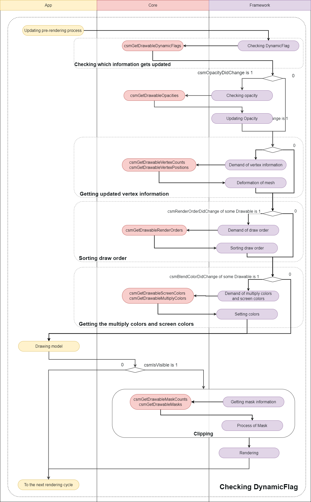

**Link to the used API**
[`csmGetDrawableDynamicFlags`](#csmgetdrawabledynamicflags)

#### Obtaining the updated vertex information

The updated vertex information is received and the information is copied to the renderer. Updating the vertice information and opacity read at initialization is only necessary.

**Updating the vertice information and opacity.**
```c
// Initialize locals.
dynamicFlags = csmGetDrawableDynamicFlags(renderer->model);
vertexPositions = csmGetDrawableVertexPositions(renderer->Model);
opacities = csmGetDrawableOpacities(renderer->Model);

for (d = 0; d < renderer->DrawableCount; ++d)
{
    // Update 'inexpensive' data without checking flags.
    renderer->drawables[d].Opacity = opacities[d];

    // Do expensive updates only if necessary.
    if ((dynamicFlags[d] & csmVertexPositionsDidChange) == csmVertexPositionsDidChange)
    {
        //Updating vertex information to graphics
        for( i = 0; i < renderer->drawables[d].vertexCount; ++i)
        {
            renderer->drawables[d].vertexPositions[i].x = vertexPositions[d][i].x;
            renderer->drawables[d].vertexPositions[i].y = vertexPositions[d][i].y;
        }
        UpdateGraphicsVertexPosition( renderer->drawables[d] );
    }
}
```

**Link to the used API**
- [`csmGetDrawableVertexPositions`](#csmgetdrawablevertexpositions)
- [`csmGetDrawableDynamicFlags`](#csmgetdrawabledynamicflags)
- [`csmGetDrawableOpacities`](#csmgetdrawableopacities)

#### Sorting drawing order of Drawable

`DrawOrder` changes by the change of parameter. As a result, if the `RenderOrder` changed, the calling order of the drawing needs to be changed.

#### DrawOrder and RenderOrder

The drawing order (`DrawOrder`) and the rendering order (`RenderOrder`) seem to be similar but different.

The drawing order is the value to be referred to for determination of the order of drawing on the art mesh on the Editor.

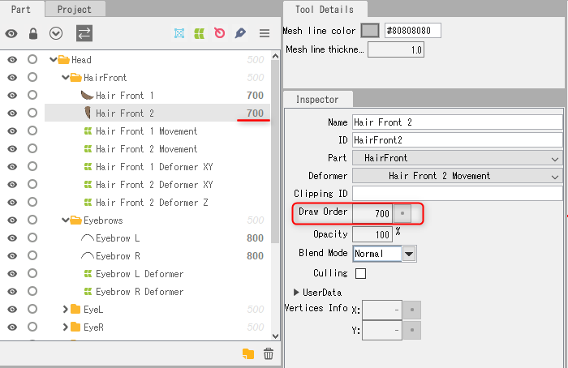

The value output by `csmGetDrawableDrawOrders` is the value in Cubism Editor's inspector. Calculation of drawing order group is not related.

Rendering order shows the order of actual rendering of Drawable relating with the drawing order.

To get the rendering order `csmGetDrawableRenderOrders()` needs to be called.

**Process of initialization for sorting.**
```c
// Initialize static fields.
for (d = 0, count = csmGetDrawableCount(model); d < count; ++d)
{
    sortableDrawable[d].DrawableIndex = d;
}
```

**Evaluation function for sorting**
```c
static int CompareSortableDrawables(const void *a, const void *b)
{
    const SortableDrawable* drawableA = (const SortableDrawable*)a;
    const SortableDrawable* drawableB = (const SortableDrawable*)b;

    return (drawableA->RenderOrder > drawableB->RenderOrder) -
           (drawableA->RenderOrder < drawableB->RenderOrder);
}
```

**Sort**
```c
renderOrders = csmGetDrawableRenderOrders(model);
count = csmGetDrawableCount(model);

// Fetch render orders.
for (d = 0; d < count; ++d)
{
    sortableDrawable[d].RenderOrder = renderOrders[sortableDrawable[d].DrawableIndex];
}

// Sort.
qsort(sortableDrawable, count, sizeof(SortableDrawable), CompareSortableDrawables);
```

**Access with sorting order on rendering**
```c
for (d = 0, count = csmGetDrawableCount(model); d < count; ++d)
{
    target = &drawable[sortableDrawable[d].DrawableIndex];
    drawing(target);
}
```

**Link to the used API**
- [`csmGetDrawableCount`](#csmgetdrawablecount)
- [`csmGetDrawableDrawOrders`](#csmgetdrawabledraworders)
- [`csmGetDrawableRenderOrders`](#csmgetdrawablerenderorders)

#### Apply mask on rendering.

To find out which Drawable a Drawable is masked `csmGetDrawableMaskCounts` and `csmGetDrawableMasks` is used.

`csmGetDrawableMaskCounts[d]` can obtain the information that how many Drawable for masking d-th Drawable is masked with.

the number on array of i-th Drawable can be obtained `csmGetDrawableMasks[d][i]`.

If there are multiple maskable Drawables, only alpha of each Drawable is synthesized.

To synthesize for mask, Normal synthesize needs to be always applied even if Additive or Multiplicative are set as Blend mode of the Drawable.

Setting of culling needs to be set for synthesizing.

Even if a Drawable is used as a mask, sometime Drawable needs not to be displayed for needs for expression. Therefore value of the opacity on the Drawable is not used to synthesizing masks each other.

If the range of the alpha value is 0.0-1.0, by setting the alpha value of drawable for which inverted mask is enabled to "1.0 - synthesized alpha value", draw clipping with the mask inverted.

**Processing Mask in Drawing process and access to mask Drawable**
```c
/* All of called functions in the following snippet are tentative. */
int d;
int drawableCount = csmGetDrawableCount(model);
const int *maskCount = csmGetDrawableMaskCounts(model);
const int **masks = csmGetDrawableMasks(model);
const csmFlags *dynamicFlags = csmGetDrawableDynamicFlags(model);
const csmFlags *constantFlags = csmGetDrawableConstantFlags(model);

for (d = 0; d < drawableCount; ++d)
{
    /* When sorted rendering order has been stored by csmGetDrawableRenderOrder in Sorters[d].RenderOrder. */
    target = Sorters[d].RenderOrder;
    if (maskCount[d] > 0)
    {
        /* Rendering when a mask exists. */
        /* Reset mask buffer */
        ResetMaskBuffer();

        /* Change rendering target to mask buffer. */
        RenderTarget(MASK);

        /* Do the common setting for rendering mask. */
        SetRenderingOpacity(1.0f);          // Opacity needs to be fixed as 1.
        SetRenderingMode(RENDER_MODE_NORMAL); // the method of synthesis needs to be fixed as Normal.
        for (i = 0; i < maskCount[target]; ++i)
        {
            int maskDrawableIndex = masks[target][i];
            /* If maskDrawableIndex gets -1, the Drawable is not exported since it is hidden for example.
             * In this case, rendering mask needs to be skipped. */
            if( maskDrawableIndex == -1)
            {
                continue;
            }

            /* If csmVertexPositionsDidChange of DynamicFlag of mask is not put up vertex information is not available.
             * In this case rendering mask needs to be skipped by continue. */
            if ((dynamicFlags[maskDrawableIndex] & csmVertexPositionsDidChange) != csmVertexPositionsDidChange)
            {
                continue;
            }

            Drawable maskingDrawable = drawable[maskDrawableIndex];
            /* Setting for mask needs to be used for setting of Culling and texture. */
            SetCulling(maskingDrawable.culling);
            SetMainTexture(maskingDrawable.texture);
            /* Rendering */
            DrawElements();
        }

        /* Get rendering target to the normal buffer. */
        RenderTarget(MAIN);

        /* Specify each item of rendering of Drawable */
        Drawable targetDrawable = drawable[target];
        SetRenderingOpacity(targetDrawable.opacity);
        SetRenderingMode(targetDrawable.renderMode);
        SetCulling(targetDrawable.culling);
        SetMainTexture(targetDrawable.texture);

        bool isInvertedMask = (constantFlags[target] & csmIsInvertedMask) != csmIsInvertedMask;
        /* Specify items which will use (if shader is different it needs to be specified on this step) */
        /* Change the shader depending on inverting the mask or not */
        SetMaskTexture(MASK, isInvertedMask);

        /* Rendering */
        DrawElements();
    }
    else
    {
        /*Rendering without mask*/
        /* Specify each item for rendering of Drawable. */
        Drawable targetDrawable = drawable[target];
        SetRenderingOpacity(targetDrawable.opacity);
        SetRenderingMode(targetDrawable.renderMode);
        SetCulling(targetDrawable.culling);
        SetMainTexture(targetDrawable.texture);

        /* Specify "not" use of mask. */
        SetMaskTexture(NULL);

        /* rendering */
        DrawElements();
    }
}
```

**Link to the used API**
- [`csmGetDrawableMaskCounts`](#csmgetdrawablemaskcounts)
- [`csmGetDrawableMasks`](#csmgetdrawablemasks)

#### Apply the multiply color and screen color to the shader

Use `csmGetDrawableMultiplyColors` and `csmGetDrawableScreenColors` for the multiply color and the screen color of a Drawable.

The multiply color set for the dth Drawable can be obtained by

`csmGetDrawableMultiplyColors[d]`, and the screen color by

`csmGetDrawableScreenColors[d]`.

Each color set for the dth Drawable can be obtained with the type `csmVector4`, where X contains the value of R, Y the value of G, Z the value of B, and W the value of A.

If multiply color is not set, the initial value is set to (1.0f, 1.0f, 1.0f, 1.0f).

This initial value is set as a value that does not affect the original color, as each RGB value is multiplied when applying the multiply color.

If screen color is not set, the initial value is set to (0.0f, 0.0f, 0.0f, 1.0f).

This initial value is set as a value that does not affect the original color, as each RGB value is added when applying the screen color.

**Gets the multiply color and screen color, and apply them to the shader**
```c
/* All of called functions in the following snippet are tentative. */

/* multiply color */
const csmVector4* multiplyColor = csmGetDrawableMultiplyColors(model);

/* screen color */
const csmVector4* screenColor = csmGetDrawableScreenColors(model);

/* Apply the multiply color and screen color to the shader */
CubismShader_OpenGLES2::GetInstance()->SetupShaderProgram(
    this, drawTextureId, vertexCount, vertexArray,
    uvArray, opacity, colorBlendMode, modelColorRGBA,
    multiplyColor[drawableIndex], // multiply color
    screenColor[drawableIndex],   // screen color
    isPremultipliedAlpha, mpvMatrix, invertedMask
);
```

**Link to the used API**
- [`csmGetDrawableMultiplyColors`](#csmgetdrawablemultiplecolors)
- [`csmGetDrawableScreenColors`](#csmgetdrawablescreencolors)

#### Getting the parameter keys

Use `csmGetParameterKeyCounts` and `csmGetParameterKeyValues` to obtain the keys set for the parameters. The number of keys set for the dth Parameter can be obtained by `csmGetParameterKeyCounts[d]`. The position of the ith key set for the dth Parameter can be obtained by `csmGetParameterKeyValues[d][i]`.

**Gets the keys set for the parameters and the number of them**
```c
/* All of called functions in the following snippet are tentative. */

/* Number of keys set for the parameters */
const int* keyCounts = csmGetParameterKeyCounts(_model);

/* Gets the position of each key set for the parameters */
const float** keyValues = csmGetParameterKeyValues(_model);

const csmChar** parameterIds = csmGetParameterIds(_model);
const csmInt32 parameterCount = csmGetParameterCount(_model);

for (csmInt32 i = 0; i < parameterCount; ++i)
{
    printf("%s: %d\n", parameterIds[i], keyCounts[i]); // Note: OCR used drawableIds, corrected to parameterIds
    for (csmInt32 j = 0; j < keyCounts[i]; ++j)
    {
        printf("3.1%f\n", keyValues[i][j]);
    }
}
```

**Link to the used API**
- [`csmGetParameterKeyCounts`](#csmgetparameterkeycounts)
- [`csmGetParameterKeyValues`](#csmgetparameterkeyvalues)

#### Determine whether repeat is set for a parameter

Use `csmGetParameterRepeats` to obtain the boolean value of whether repeat is set for a parameter. The repeat value set for the dth parameter can be obtained with `csmGetParameterRepeats[d]`.

**Getting the repeat boolean value set for the parameters**
```c
/* All of called functions in the following snippet are tentative. */

/* Getting the repeat boolean value set for the parameters */
const int* repeats = csmGetParameterRepeats(_model);

const csmChar** parameterIds = csmGetParameterIds(_model);
const csmInt32 parameterCount = csmGetParameterCount(_model);

for (csmInt32 i = 0; i < parameterCount; ++i)
{
    /* Export the repeat boolean value */
    if(repeats[i])
    {
        printf("%s : Repeat\n", parameterIds[i]);
    }
    else
    {
        printf("%s : Clamp\n", parameterIds[i]);
    }
}
```

**Link to the used API**
[`csmGetParameterRepeats`](#csmgetparameterrepeats)

---

## Individual APIs

### Naming rule for the APIs.

#### SOA structure

If there is API called `csmGet[XXXX]Count`,

arrays obtained by API group of `csmGet[XXXX][YYYY]s` are stored in the same order.

For more details, please refer to "[Loading and placement Drawable](#loading-and-placement-drawable)".

#### InPlace

`CsmReviveMocInPlace` with `InPlace` and `csmInitializeModelInPlace` indicates that they are APIs manipulate specified memory space.

For more details, please refer to "[Release csmMoc or csmModel](#release-csmmoc-or-csmmodel)".

---

### `csmGetVersion`
Return version information of The Core.

#### Argument
None

#### Return value
- `csmVersion` (unsigned int)

Notation of the versions consists of three parts: MAJOR, MINOR, and PATCH. The followings are the rules for management of each part.

*   **MAJOR version (1byte)**
    This is incremented when backward compatibility with model data (.moc3 file) has been lost by, for instance, by major version up of Cubism Editor.
*   **MINOR version (1byte)**
    This is incremented when new functions are added with backward compatibility kept.
*   **PATCH number (2byte)**
    This is incremented when defect failure has been fixed. If the MAJOR version or MINOR version is changed, the PATCH number is reset to 0.

```
0x 00 00 0000
   Major Minor Patch
```

Version consists of 4 bytes. Also, the newer version of the Core always indicates the bigger number by treating it as unsigned integer.

#### Item with description
[How to obtain version information of the Core.](#how-to-obtain-the-version-information-of-the-core)

#### Available version
3.0.00 or higher

---

### `csmGetLatestMocVersion`
Returns the new file version that Core can process.

#### Argument
None

#### Return value
- `csmMocVersion` (unsigned int)

#### Item with description
[File version of moc3](#file-version-of-moc3)

#### Available version
3.3.01 or higher

---

### `csmGetMocVersion`
Returns the moc3 file version from the loaded memory of .moc3 file.

#### Argument
- `void* address`
  The address of the head of the data array which includes .moc3.
- `const unsigned int size`
  .moc3 is the length of the data array which includes .moc3.

#### Return value
- `csmMocVersion` (unsigned int)
```c
/** moc3 file format version. */
enum
{
    /** unknown */
    csmMocVersion_Unknown = 0,
    /** moc3 file version 3.0.00 - 3.2.07 */
    csmMocVersion_30 = 1,
    /** moc3 file version 3.3.00 - 3.3.03 */
    csmMocVersion_33 = 2,
    /** moc3 file version 4.0.00 - 4.1.05 */
    csmMocVersion_40 = 3,
    /** moc3 file version 4.2.00 - 4.2.02 */
    csmMocVersion_42 = 4,
    /** moc3 file version 5.0.00 - */
    csmMocVersion_50 = 5
};
/** moc3 version identifier. */
typedef unsigned int csmMocVersion;
```
If the load is not a moc3 file returns the `csmMocVersion_Unknown`. Please be careful that there is a possibility that the value more than the value defined in the Live2DCubismCore.h will be got by the version-up of Cubism Editor. To find the file version or that you can use, please be compared with the results of `csmGetLatestMocVersion`.

#### Item with description
[File version of moc3](#file-version-of-moc3)

#### Available version
3.3.01 or higher

---

### `csmGetLogFunction`
Returns a pointer to the saved log function.

#### Argument
None

#### Return value
- `csmLogFunction` (address)
```c
/** Log handler.
 *
 * @param message Null-terminated string message to log.
 */
typedef void (*csmLogFunction)(const char* message);
```

#### Item with description
[Output log of the Core.](#output-log-of-the-core)

#### Available version
3.0.00 or higher

---

### `csmSetLogFunction`
Specify function to output logs

#### Argument
- `csmLogFunction` handler
```c
/** Log handler.
 *
 * @param message Null-terminated string message to log.
 */
typedef void (*csmLogFunction)(const char* message);
```
#### Return value
None

#### Item with description
[Output log of the Core.](#output-log-of-the-core)

#### Available version
3.0.00 or higher

---

### `csmReviveMocInPlace`
Play the `csmMoc` structure in a memory that .moc3 file is loaded.

>**The address passed by address must satisfy the default alignment.**

**Description of the alignment size in the include file**
```c
/** Alignment constraints. */
enum
{
    /** Necessary alignment for mocs (in bytes). */
    csmAlignofMoc = 64,
};
```
The played `csmMoc` structure needs be released after all `csmModels` generated from `csmMoc` has been released.

For more details, please refer to "[How to load a Moc3 file and to expand up to the csmModel object](#how-to-load-a-moc3-file-and-to-expand-up-to-the-csmmodel-object)"

#### Argument
- `void* address`
  The address of the head of the data array which includes .moc3. Alignment is necessary.
- `const unsigned int size`
  .moc3 is the length of the data array which includes .moc3

#### Return value
- `csmMoc*`
  Address to `csmMoc` structure. It gets NULL when there is a problem.

#### Item with description
[How to load a Moc3 file and to expand up to the csmModel object](#how-to-load-a-moc3-file-and-to-expand-up-to-the-csmmodel-object)

#### Available version
3.0.00 or higher

---

### `csmGetSizeofModel`
It returns the size of the Model structure generated from the Moc structure. This is used for securing memory.

#### Argument
- `const csmMoc* moc`
  Address to Moc structure

#### Return value
- `unsigned int`
  Size of Model structure

#### Item with description
[How to load a Moc3 file and to expand up to the csmModel object](#how-to-load-a-moc3-file-and-to-expand-up-to-the-csmmodel-object)

#### Available version
3.0.00 or higher

---

### `csmInitializeModelInPlace`
It initializes the Model structure by the Moc structure.

> **Prepare the aligned memory.**

**Description of the alignment size in the include file**
```c
/** Alignment constraints. */
enum
{
    /** Necessary alignment for models (in bytes). */
    csmAlignofModel = 16
};
```
#### Argument
- `const csmMoc* moc`
  Address to Moc structure
- `void* address`
  Address of allocated memory
- `const unsigned int size`
  Size of allocated memory

#### Return value
- `csmModel*`

#### Item with description
[How to load a Moc3 file and to expand up to the csmModel object](#how-to-load-a-moc3-file-and-to-expand-up-to-the-csmmodel-object)

#### Available version
3.0.00 or higher

---

### `csmUpdateModel`
It reflects the operation of parameters and parts on vertex information and so on.

#### Argument
- `csmModel* model`
  Address to model structure

#### Return value
None

#### Item with description
[Applying the operation to the model.](#applying-the-operation-to-the-model)

#### Available version
3.0.00 or higher

---

### `csmReadCanvasInfo`
It returns the canvas size, center point and unit size of the model.

#### Argument
- `const csmModel* model`
  Address to model structure
- `csmVector2* outSizeInPixels`
  Address to `csmVector2` for storing model canvas size
- `csmVector2* outOriginInPixels`
  Address to `csmVector2` to store the center point of the model canvas
- `float* outPixelsPerUnit`
  Unit size of model

#### Return value
None

#### Item with description
[Get rendering size of model](#get-rendering-size-of-model)

#### Available version
3.0.00 or higher

---

### `csmGetParameterCount`
It returns the number of parameters owned by the model.

#### Argument
- `const csmModel* model`
  Address to model structure

#### Return value
- `int`
  Number of parameters to hold

#### Item with description
[Acquiring each element of the parameter](#acquiring-each-element-of-the-parameter)

#### Available version
3.0.00 or higher

---

### `csmGetParameterIds`
It returns the array address which stores the ID of the parameter of the model.

#### Argument
- `const csmModel* model`
  Address to model structure

#### Return value
- `const char**`
  Address to the array where string address is stored

#### Item with description
[Acquiring each element of the parameter](#acquiring-each-element-of-the-parameter)

#### Available version
3.0.00 or higher

---

### `csmGetParameterTypes`
It returns the array address containing the ID of the parameter of the model.

#### Argument
- `const csmModel* model`
  Address to model structure

#### Return value
- `const csmParameterType*`
  Address to the array where parameter types are stored
```c
/** Parameter types. */
enum
{
    /** Normal Parameter. */
    csmParameterType_Normal = 0,
    /** Parameter for blend shape. */
    csmParameterType_BlendShape = 1
};
/** Parameter type. */
typedef int csmParameterType;
```

#### Item with description
[Acquiring each element of the parameter](#acquiring-each-element-of-the-parameter)

#### Available version
4.2.02 or higher

---

### `csmGetParameterMinimumValues`
It returns an address to an array which stores only the minimum value of the parameter.

#### Argument
- `const csmModel* model`
  Address to model structure

#### Return value
- `const float*`
  Address to the array containing the minimum value

#### Item with description
[Acquiring each element of the parameter](#acquiring-each-element-of-the-parameter)

#### Available version
3.0.00 or higher

---

### `csmGetParameterMaximumValues`
It returns an address to an array which stores only the maximum value of the parameter.

#### Argument
- `const csmModel* model`
  Address to model structure

#### Return value
- `const float*`
  Address to the array containing the maximum value

#### Item with description
[Acquiring each element of the parameter](#acquiring-each-element-of-the-parameter)

#### Available version
3.0.00 or higher

---

### `csmGetParameterDefaultValues`
It returns an address to an array which stores only the default values of parameters.

#### Argument
- `const csmModel* model`
  Address to model structure

#### Return value
- `const float*`
  Address to the array containing the default value

#### Item with description
- [Acquiring each element of the parameter](#acquiring-each-element-of-the-parameter)
- [Operating parameters](#operating-parameters)

#### Available version
3.0.00 or higher

---

### `csmGetParameterValues`
It returns an address to an array of just the current values of the parameters. **Manipulate the model by writing to this array.**

#### Argument
- `csmModel* model`
  Address to model structure

#### Return value
- `const float*`
  Address to the array where the current value is stored.

#### Item with description
- [Acquiring each element of the parameter](#acquiring-each-element-of-the-parameter)
- [Operating parameters](#operating-parameters)

#### Available version
3.0.00 or higher

---

### `csmGetParameterRepeats`
Use `csmGetParameterRepeats` to obtain the boolean value of whether repeat is set for a parameter.

#### Argument
- `csmModel* model`
  Address to model structure

#### Return value
- `const int*`
  Address to the array storing the repeat boolean value set for the parameters

#### Item with description
[Determine whether repeat is set for a parameter](#determine-whether-repeat-is-set-for-a-parameter)

#### Available version
5.1.00 or higher

---

### `csmGetParameterKeyCounts`
Address to the array storing the numbers of keys set for the parameters

#### Argument
- `const csmModel* model`
  Address to model structure

#### Return value
- `const int*`
  Address to the array storing the numbers of keys set for the parameters

#### Item with description
[Getting the parameter keys](#getting-the-parameter-keys)

#### Available version
4.1.00 or higher

---

### `csmGetParameterKeyValues`
Returns the address to the jagged array storing the positions of keys set for the parameters.

#### Argument
- `const csmModel* model`
  Address to model structure

#### Return value
- `const float**`
  Address to the jagged array storing the positions of keys set for the parameters

#### Item with description
[Getting the parameter keys](#getting-the-parameter-keys)

#### Available version
4.1.00 or higher

---

### `csmGetPartCount`
It returns the number of parts the model. http://docs.live2d.com/cubism-editor-manual/parts/

#### Argument
- `const csmModel* model`
  Address to model structure

#### Return value
- `int`
  Number of parts

#### Item with description
None

#### Available version
3.0.00 or higher

---

### `csmGetPartIds`
It returns the address to the array which stores the part ID of the model.

#### Argument
- `const csmModel* model`
  Address to model structure

#### Return value
- `const char**`
  Address to the array where string address is stored

#### Item with description
None

#### Available version
3.0.00 or higher

---

### `csmGetPartOpacities`
It returns the address to the array which stores the current value of the opacity of the part of the model.

#### Argument
- `csmModel* model`
  Address to model structure

#### Return value
- `float*`
  Address of part opacity array

#### Item with description
[Operating parts opacity.](#operating-parts-opacity)

#### Available version
3.0.00 or higher

---

### `csmGetPartParentPartIndices`
It returns the parent of the parts by index in array. If the parent of the part is Root, -1 will be stored.

#### Argument
- `csmModel* model`
  Address to model structure

#### Return value
- `const int*`
  Address of the array stored the index to the parent of the parts

#### Item with description
[Gets the parent parts of parts](#gets-the-parent-parts-of-parts)

#### Available version
3.3.00 or higher

---

### `csmGetDrawableCount`
It returns the number of Drawables the model.

#### Argument
- `const csmModel* model`
  Address to model structure

#### Return value
- `int`
  Number of Drawables the model has

#### Item with description
- [Loading and placement Drawable](#loading-and-placement-drawable)
- [Sorting drawing order of Drawable](#sorting-drawing-order-of-drawable)

#### Available version
3.0.00 or higher

---

### `csmGetDrawableIds`
Returns the address to the array which stores the ID of the model possessed by the model.

#### Argument
- `const csmModel* model`
  Address to model structure

#### Return value
- `const char**`
  Address to the array where string address is stored

#### Item with description
[Loading and placement Drawable](#loading-and-placement-drawable)

#### Available version
3.0.00 or higher

---

### `csmGetDrawableConstantFlags`
It returns the address to the array which stores the static flags of the Drawable possessed by the model.
The flags described here contain the following four elements:
- flags regarding blend of rendering
  - Add rendering
  - Multiply rendering
- flag for culling of Drawable
  - Double-sided rendering
- Flag of the mask of Drawable **(Added since 4.0.0)**
  - Inverted mask

#### Argument
- `const csmModel* model`
  Address to model structure

#### Return value
- `const csmFlags*`
  Address for array of a flag
```c
/** Bitfield. */
typedef unsigned char csmFlags;
```
#### Item with description
[Loading and placement Drawable](#loading-and-placement-drawable)

#### Available version
3.0.00 or higher

---

### `csmGetDrawableDynamicFlags`
It returns the address to the array which stores the flags updated when drawable owned by the model gets rendered.
The flags updated on rendering contain the following six elements.
- Visibility of rendering
- Change of visibility of rendering
- Change of opacity
- Change of rendering order
- Replacement of rendering order
- Vertex information update

#### Argument
- `const csmModel* model`
  Address to model structure

#### Return value
- `const csmFlags*`
  Address for the array of flag
```c
/** Bitfield. */
typedef unsigned char csmFlags;
```

#### Item with description
- [Loading and placement Drawable](#loading-and-placement-drawable)
- [Applying the operation to the model.](#applying-the-operation-to-the-model)
- [Confirmation of updated information](#confirmation-of-updated-information)
- [Obtaining the updated vertex information](#obtaining-the-updated-vertex-information)

#### Available version
3.0.00 or higher

---

### `csmGetDrawableTextureIndices`
It returns the address of the array which stores the texture number referred to by the drawable owned by the model.
The texture number means the number given to the texture atlas to which the art mesh belongs.

#### Argument
- `const csmModel* model`
  Address to model structure

#### Return value
- `const int*`
  Address of the array containing the texture number

#### Item with description
[Loading and placement Drawable](#loading-and-placement-drawable)

#### Available version
3.0.00 or higher

---

### `csmGetDrawableDrawOrders`
It returns the address for the array which stores the drawing order of the drawing possessed by the model.
Based on the current parameter value, this value stores the interpolated calculation result. The influence of the rendering order group is ignored.

#### Argument
- `const csmModel* model`
  Address to model structure

#### Return value
- `const int*`
  Address for the array containing the rendering order

#### Item with description
- [Loading and placement Drawable](#loading-and-placement-drawable)
- [Applying the operation to the model.](#applying-the-operation-to-the-model)
- [Sorting drawing order of Drawable](#sorting-drawing-order-of-drawable)

#### Available version
3.0.00 or higher

---

### `csmGetDrawableRenderOrders`
It returns the address for the array which stores the rendering order of the drawing possessed by the model.
It rendered in the same order as displayed in Cubism Editor.

#### Argument
- `const csmModel* model`
  Address to model structure

#### Return value
- `const int*`
  Address for the array containing the rendering order

#### Item with description
- [Loading and placement Drawable](#loading-and-placement-drawable)
- [Applying the operation to the model.](#applying-the-operation-to-the-model)
- [Sorting drawing order of Drawable](#sorting-drawing-order-of-drawable)

#### Available version
3.0.00 or higher

---

### `csmGetDrawableOpacities`
It returns the address for the array which stores the opacity value of the Drawable possessed by the model.
The value will be between 0.0 and 1.0.

#### Argument
- `const csmModel* model`
  Address to model structure

#### Return value
- `const float*`
  Address for array containing opacity

#### Item with description
- [Loading and placement Drawable](#loading-and-placement-drawable)
- [Applying the operation to the model.](#applying-the-operation-to-the-model)
- [Confirmation of updated information](#confirmation-of-updated-information)
- [Obtaining the updated vertex information](#obtaining-the-updated-vertex-information)

#### Available version
3.0.00 or higher

---

### `csmGetDrawableMaskCounts`
It returns an address to an array which stores the number of Drawable owned by the model.

#### Argument
- `const csmModel* model`
  Address to model structure

#### Return value
- `const int*`
  Address for the array containing the number of masks

#### Item with description
- [Loading and placement Drawable](#loading-and-placement-drawable)
- [Apply mask on rendering.](#apply-mask-on-rendering)

#### Available version
3.0.00 or higher

---

### `csmGetDrawableMasks`
It returns the address of the jagged array which stores the Drawable number of the masks of Drawable owned by the model.
Handle it carefully since 0 in `csmGetDrawableMaskCounts` contains address information used in other masks in Drawable.

#### Argument
- `const csmModel* model`
  Address to model structure

#### Return value
- `const int**`
  Address for the array of addresses containing mask reference number

#### Item with description
- [Loading and placement Drawable](#loading-and-placement-drawable)
- [Apply mask on rendering.](#apply-mask-on-rendering)

#### Available version
3.0.00 or higher

---

### `csmGetDrawableVertexCounts`
It returns the address for the array which stores the number of vertices of the drawable possessed by the model.

#### Argument
- `const csmModel* model`
  Address to model structure

#### Return value
- `const int*`
  Address for an array containing the number of vertices of Drawable

#### Item with description
- [Loading and placement Drawable](#loading-and-placement-drawable)
- [Apply mask on rendering.](#apply-mask-on-rendering)

#### Available version
3.0.00 or higher

---

### `csmGetDrawableVertexPositions`
It returns the address to the jagged array which stores the vertex of the drawable possessed by the model.

#### Argument
- `const csmModel* model`
  Address to model structure

#### Return value
- `const csmVector2**`
  Address to jagged array to vertex information
```c
/** 2 component vector. */
typedef struct
{
    /** First component. */
    float X;

    /** Second component. */
    float Y;
} 
csmVector2;
```

#### Item with description
- [Loading and placement Drawable](#loading-and-placement-drawable)
- [Applying the operation to the model.](#applying-the-operation-to-the-model)
- [Confirmation of updated information](#confirmation-of-updated-information)
- [Obtaining the updated vertex information](#obtaining-the-updated-vertex-information)

#### Available version
3.0.00 or higher

---

### `csmGetDrawableVertexUvs`
It returns the address to the jagged array which stores the UV information of Drawable possessed by the model.
Since it corresponds to each vertex, the number of vertex get obtained with `csmGetDrawableVertexCounts`.

#### Argument
- `const csmModel* model`
  Address to model structure

#### Return value
- `const csmVector2**`
  Address to jagged array to vertex information

#### Item with description
[Loading and placement Drawable](#loading-and-placement-drawable)

#### Available version
3.0.00 or higher

---

### `csmGetDrawableIndexCounts`
It returns the address of an array which stores the size of the corresponding number array of polygons against the vertex of the model possessed by the model.
Since it becomes an array describing which corner of a triangle corresponds each vertex, the value stored in this array always gets 0 or a multiple of 3.

> **Note that the size of Indices becomes zero at the end of skinning.**

#### Argument
- `const csmModel* model`
  Address to model structure

#### Return value
- `const int*`
  address of an array that stores the size of the corresponding number array of polygons.

#### Item with description
[Loading and placement Drawable](#loading-and-placement-drawable)

#### Available version
3.0.00 or higher

---

### `csmGetDrawableIndices`
It returns the address to the jagged array which corresponds Drawable number of the vertexes of Drawable owned by the model.
Each drawable has stored number which is independent.
Handle it carefully since 0 in `csmGetDrawableIndexCounts` contains address information used in other Drawable.

#### Argument
- `const csmModel* model`
  Address to model structure

#### Return value
- `const unsigned short**`
  Address to the corresponding number of jagged array.

#### Item with description
[Loading and placement Drawable](#loading-and-placement-drawable)

#### Available version
3.0.00 or higher

---

### `csmResetDrawableDynamicFlags`
In order to refresh the information obtained by `csmGetDrawableDynamicFlags` at the next `csmUpdateModel`, all flags needs to be taken down.
The timing for the call is right after the drawing process is over.

#### Argument
- `csmModel* model`
  Address to model structure

#### Return value
None

#### Item with description
[Reset of DynamicFlag](#reset-of-dynamicflag)

#### Available version
3.0.00 or higher

---

### `csmGetDrawableMultiplyColors`
Returns the address to the array storing the multiply colors of ArtMeshes.

#### Argument
- `csmModel* model`
  Address to model structure

#### Return value
- `const csmVector4*`
  Address to the array storing the RGBA values of the multiply color of ArtMeshes. X corresponds to R, Y to G, and Z to B (Value of W currently unused)
```c
/** 4 component vector. */
typedef struct
{
    /** 1st component. */
    float X;

    /** 2nd component. */
    float Y;

    /** 3rd component. */
    float Z;

    /** 4th component. */
    float W;
} csmVector4;
```

#### Item with description
[Apply the multiply color and screen color to the shader](#apply-the-multiply-color-and-screen-color-to-the-shader)

#### Available version
4.2.00 or higher

---

### `csmGetDrawableScreenColors`
Returns the address to the array storing the screen colors of ArtMeshes.

#### Argument
- `csmModel* model`
  Address to model structure

#### Return value
- `const csmVector4*`
  Address to the array storing the RGBA values of the screen color of ArtMeshes. X corresponds to R, Y to G, and Z to B (Value of W currently unused)
```c
/** 4 component vector. */
typedef struct
{
    /** 1st component. */
    float X;

    /** 2nd component. */
    float Y;

    /** 3rd component. */
    float Z;

    /** 4th component. */
    float W;
} csmVector4;
```
#### Item with description
[Apply the multiply color and screen color to the shader](#apply-the-multiply-color-and-screen-color-to-the-shader)

#### Available version
4.2.00 or higher

---

### `csmGetDrawableParentPartIndices`
It returns the parent of Drawable by index in array.
If the parent of Drawable is Root, -1 will be stored.

#### Argument
- `const csmModel* model`
  Address to model structure

#### Return value
- `const int*`
  address of an array that stores the size of the corresponding number array of polygons.

#### Item with description
[Gets the parent parts of Drawable](#gets-the-parent-parts-of-drawable)

#### Available version
4.2.02 or higher

---

### `csmHasMocConsistency`
Checks the consistency of the .moc3 file

> **Prepare the aligned memory.**

#### Argument
- `const csmMoc* moc`
  
  Address to Moc structure
- `void* address`
  
  Address of allocated memory.
  
  Alignment is necessary.
- `const unsigned int size`
  
  Size of allocated memory

#### Return value
- `int`
  
  .moc3 consistency.
  
  '1' if the loaded .moc3 is valid, otherwise '0'.

#### Item with description
[How to load a Moc3 file and to expand up to the csmModel object](#how-to-load-a-moc3-file-and-to-expand-up-to-the-csmmodel-object)

#### Available version
4.2.03 or higher
