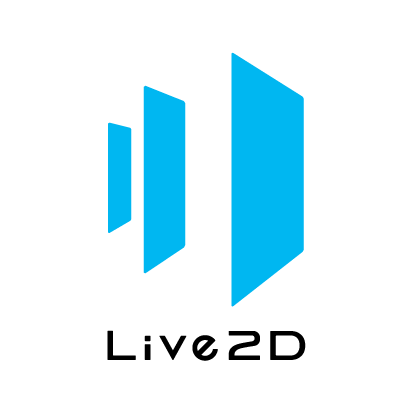

[English](README.md) / [日本語](README.ja.md)

---


# Cubism Native Samples

Live2D Cubism Editor で出力したモデルを表示するアプリケーションのサンプル実装です。

Cubism Native Framework および Live2D Cubism Core と組み合わせて使用します。


## ライセンス

本 SDK を使用する前に[ライセンス](LICENSE.md)をご確認ください。


## お知らせ

本 SDK を使用する前に [お知らせ](NOTICE.ja.md)をご確認ください。


## Cubism 5新機能や過去バージョンとの互換性について

本 SDK はCubism 5に対応した製品です。  
Cubism 5 Editorに搭載された新機能のSDK対応については [こちら](https://docs.live2d.com/cubism-sdk-manual/cubism-5-new-functions/)をご確認ください。  
過去バージョンのCubism SDKとの互換性については [こちら](https://docs.live2d.com/cubism-sdk-manual/compatibility-with-cubism-5/)をご確認ください。


## ディレクトリ構成

```
.
├─ Core             # Live2D Cubism Core が含まれるディレクトリ
├─ Framework        # レンダリングやアニメーション機能などのソースコードが含まれるディレクトリ
└─ Samples
   ├─ Cocos2d-x     # Cocos2d-x のサンプルプロジェクトが含まれるディレクトリ
   ├─ D3D9          # DirectX 9.0c のサンプルプロジェクトが含まれるディレクトリ
   ├─ D3D11         # DirectX 11 のサンプルプロジェクトが含まれるディレクトリ
   ├─ Metal         # Metal のサンプルプロジェクトが含まれるディレクトリ
   ├─ OpenGL        # OpenGL のサンプルプロジェクトが含まれるディレクトリ
   ├─ Vulkan        # Vulkan のサンプルプロジェクトが含まれるディレクトリ
   └─ Resources     # モデルのファイルや画像などのリソースが含まれるディレクトリ
```


## Cubism Native Framework

モデルを表示、操作するための各種機能を提供します。

[Cubism Native Framework] は、当リポジトリのサブモジュールとして含まれています。
当リポジトリをクローンした後、サブモジュールのクローンを実行することでファイルが追加されます。

[Cubism Native Framework]: (https://github.com/Live2D/CubismNativeFramework)


## Live2D Cubism Core for Native

モデルをロードするためのライブラリです。
当リポジトリには Live2D Cubism Core for Native は同梱されていません。

ダウンロードするには[こちら](https://www.live2d.com/download/cubism-sdk/download-native/)のページを参照ください。
ダウンロードした Zip ファイルの中身を当リポジトリの `Core` ディレクトリにコピーし、プログラムにリンクさせてください。


## ビルド方法

ビルド方法についてはサンプルプロジェクトによって異なります。
各サンプルプロジェクトに同梱された `README.md` を参照ください。

### サンプルプロジェクトの成果物の生成場所

本サンプルでは、Android を除く CMake プロジェクトの成果物は `bin` ディレクトリに生成されます。

例）OpenGL サンプルの macOS プロジェクトのビルドを `make_gcc` スクリプトを使用して行なった場合
```
Demo
└─ proj.mac.cmake
   └─ build
      └─ make_gcc
         └─ bin
            └─ Demo
               ├─ Resources    # Samples/Resources と同じ
               └─ Demo         # 実行可能なアプリケーション
```


## コンパイルオプション

プロジェクトにおいて、マクロ `USE_RENDER_TARGET` または `USE_MODEL_RENDER_TARGET` が有効な場合、
モデルがテクスチャへレンダリングされるようになります。
詳細はサンプルディレクトリ内の `LAppLive2DManager.cpp` を参照ください。


## SDKマニュアル

[Cubism SDK Manual](https://docs.live2d.com/cubism-sdk-manual/top/)


## 変更履歴

Samples : [CHANGELOG.md](CHANGELOG.md)

Framework : [CHANGELOG.md](Framework/CHANGELOG.md)

Core : [CHANGELOG.md](Core/CHANGELOG.md)


## 開発環境

| 開発ツール | バージョン |
| --- | --- |
| Android Studio | Iguana 2023.2.1 |
| CMake | 3.28.3 |
| Visual Studio 2013 | Update 5 |
| Visual Studio 2015 | Update 3 |
| Visual Studio 2017 | 15.9.60 |
| Visual Studio 2019 | 16.11.34 |
| Visual Studio 2022 | 17.9.4 |
| Xcode | 15.3 |

### Android

| Android SDK tools | バージョン |
| --- | --- |
| Android NDK | 26.2.11394342 |
| Android SDK | 34.0.0 |
| CMake | 3.22.1 |

### Linux

| 系統 | ディストリビューション・バージョン | Docker イメージ | GCC |
| --- | --- | --- | --- |
| Red Hat | Amazon Linux 2 |  `amazonlinux:2` | 7.3.1 |
| Red Hat | CentOS 7 | `centos:7` | 4.8.5 |
| Red Hat | CentOS Stream 8 *1 | `centos:latest` | 8.5.0 |
| Red Hat | CentOS Stream 9 | - | 12.2.1 |
| Red Hat | AlmaLinux | `almalinux:latest` | 11.4.1 |
| Debian | Ubuntu 18.04 | `ubuntu:18.04` | 7.5.0 |
| Debian | Ubuntu 22.04.4 | `ubuntu:22.04` | 11.4.0 |

*1 CentOS 8はサポートしておりません

#### Mesa ライブラリ

* Red Hat
  * `mesa-libGL-devel`
  * `mesa-libGLU-devel`
* Debian
  * `libgl1-mesa-dev`
  * `libglu1-mesa-dev`


## 動作確認環境

| プラットフォーム | バージョン |
| --- | --- |
| iOS / iPadOS | 17.4 |
| macOS | 14.4 |
| Windows 10 | 22H2 |
| Windows 11 | 22H2 |

### Android

| バージョン | デバイス | Tegra |
| --- | --- | --- |
| 13 | Pixel 7a | |
| 7.1.1 | Nexus 9 | ✔︎ |

### Linux

| 系統 | ディストリビューション | バージョン |
| --- | --- | --- |
| Red Hat | Amazon Linux | 2 |
| Red Hat | AlmaLinux | 9 |
| Debian | Ubuntu | 22.04.4 |

## プロジェクトへの貢献

プロジェクトに貢献する方法はたくさんあります。バグのログの記録、このGitHubでのプルリクエストの送信、Live2Dコミュニティでの問題の報告と提案の作成です。

### フォークとプルリクエスト

修正、改善、さらには新機能をもたらすかどうかにかかわらず、プルリクエストに感謝します。メインリポジトリを可能な限りクリーンに保つために、必要に応じて個人用フォークと機能ブランチを作成してください。

### バグ

Live2Dコミュニティでは、問題のレポートと機能リクエストを定期的にチェックしています。バグレポートを提出する前に、Live2Dコミュニティで検索して、問題のレポートまたは機能リクエストがすでに投稿されているかどうかを確認してください。問題がすでに存在する場合は、関連するコメントを追記してください。

### 提案

SDKの将来についてのフィードバックにも関心があります。Live2Dコミュニティで提案や機能のリクエストを送信できます。このプロセスをより効果的にするために、それらをより明確に定義するのに役立つより多くの情報を含めるようお願いしています。

## フォーラム

ユーザー同士でCubism SDKの活用方法の提案や質問をしたい場合は、是非フォーラムをご活用ください。

- [Live2D 公式クリエイターズフォーラム](https://creatorsforum.live2d.com/)
- [Live2D Creator's Forum(English)](https://community.live2d.com/)



